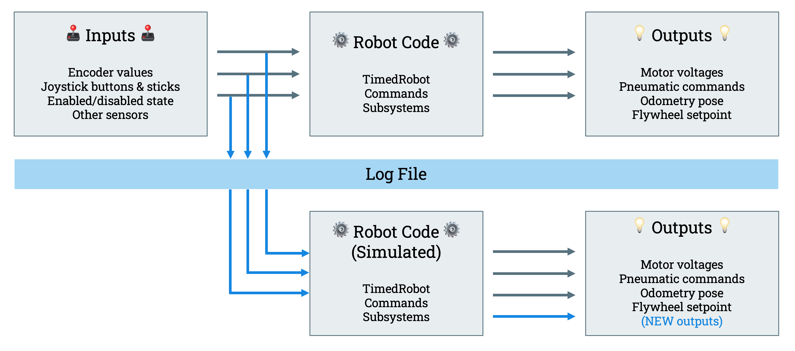

# FRC 3655 Tractor Technicians Base Swerve
The following code serves as a starting point for the construction of the 3655 swerve drive robot.  The code assumes the following construction:
* MK4i SDS Modules
* CTRE Kraken X60 drive and turn motors
* CTRE CANCoder absolute encoders embeded in each module
* Pidgeon 2.0 gyro equipped chassis
* Isolated CANivore CAN bus for the FX drive/turn motors and associated CANCoders
* 2 mounted limelight cameras

The following information provides some context for the code construction for those new to the
team or wanting to learn more about its implementation.

## Noteable Concepts
### Synchronized:

>"In a very, very small nutshell: When you have two threads that are reading and writing to the same 'resource', say a variable named foo, you need to ensure that these threads access the variable in an atomic way. Without the synchronized keyword, your thread 1 may not see the change thread 2 made to foo, or worse, it may only be half changed. This would not be what you logically expect."

### Implements -> Interface

Why are IO's interfaces and not classes?  Why do the subclasses implement an interface and not extend a class?

Extended classes offer their methods for the subclasses to use.  An interface, implemented by a class, is an empty shell that contains only signatures of methods - implying that the methods do not have a body (you can see this by checking out `GyroIO` or `ModuleIO`).

>"They (interfaces) are only the signatures of methods, which implies that the methods do not have a body." - Stack Overflow

>"Interfaces establish an is-a relationship between objects which guarantees that objects that implement it will have the same behavior"

We construct IO's as an interface because we are defining a blueprint that subclasses *must follow* when they are created.  This avoids issues when constructing a simulation IO, real IO, or alternative IO's (e.g. Pidgeon or NavX gyro) from the parent interface.

[Consider reading the following comment about the usage of interfaces](https://www.reddit.com/r/learnjava/comments/az1tmi/comment/ei5au43/?utm_source=share&utm_medium=web3x&utm_name=web3xcss&utm_term=1&utm_content=share_button)

## IO Structure

>"Advantagekit records all of the data flowing into the robot code.  Every sensor value, button press, and much more is logged every loop"

In order to utilize the data we log entering the robot, we construct the code to be run through simluation by branching it at each component.  By changing the CURRENTMODE (in constants) of the robot, the robot can be constructed with either simluated or *real* parts.  e.g. ModuleIOSim as opposed to ModuleIOTalonFXPro .

An Input/Output, IO, is constructed for subsystems to accept as parameters when constructed.
e.g., the drive subsystem requires both a GyroIO and ModuleIO when constructed that define
the physical characteristics of the robot.

Depending on the CURRENTMODE (REAL or SIM), the RobotContainer constructs the subsystems at boot using subclasses of the IO classes.  e.g., both ModuleIO and ModuleIOTalonFXPro implement ModuleIO and override the abstract methods found within.

## Drive
When beginning on a project, we often ask "how can I get the robot to just move?".  While it seems like a simple question, with swerve drive and this structure, it can be confusing where things start and where they end.  The following tracks the information passed through the code starting from the joystick motion to the drive/turn motors beginning to move.

_RobotContainer.java_
* Pass controller axes from `RobotContainer` to `joystickDrive` as default command
* `joystickDrive` is a nested class of DriveCommands.java

_DriveCommands.java_
* `Translation2d` is constructed from joystick inputs
* `ChassisSpeeds` object is constructed from the Translation2d and sent to DriveSubsystem

_DriveSubsystem.java_
* `ChassisSpeeds` object is turned into `SwerveModuleStates` using the robot's kinematics in `periodic`
* `SwerveModuleStates` is desaturated to remove any value above 100% speed for any given module
* Each entry in the `SwerveModuleStates` array is optimized - module takes the shortest path to get to
the correct angle.
* Each swerveModule(0-3) is set to a `targetState` using the optimized `SwerveModuleStates` - done through the `Module`

_Module.java_
* Inside the `setTargetState` method, calculations are done and then it passes the resulting velocity and turn position to the subclass IO (e.g for real, the `ModuleIOTalonFXPro`).  

_ModuleIOTalonFXPro_
* **At this point, the code splits to log information**
* The target velocity is passed to the `Module` via `setTargetDriveVelocity`.  Within this method, the value is sent to the real motors and to the AdvantageKit inputs.
* The target steer position is passed to `Module` via `setTargetSteerPosition`.  Within this method, the value is sent to the real motors and to the AdvantageKit inputs.

_Robot go brrrrr.java_
